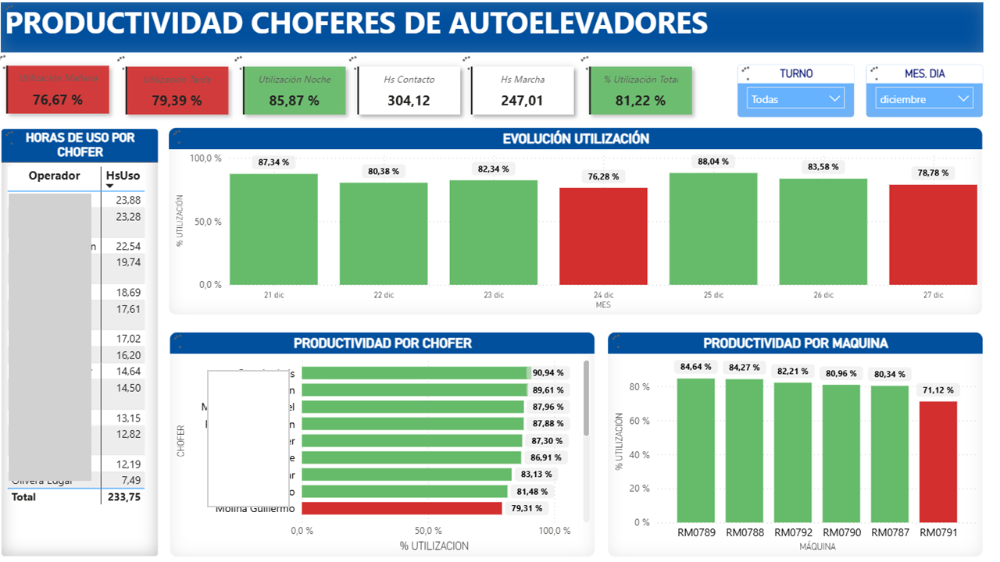

## Forklift Utilization Productivity Dashboard
### Dashboard Preview

### Context
Operational dashboard designed to analyze forklift utilization and driver productivity in warehouse operations.

### Business Questions
- What is the utilization rate by shift (morning, afternoon, night)?
- How efficiently are forklifts being used throughout the day?
- Which drivers or machines show lower utilization levels?

### KPIs
- Forklift utilization rate (%)
- Operating hours vs idle time
- Utilization by driver
- Utilization by machine
- Shift performance comparison

### Tools
- Power BI
- DAX
- Excel

### Outcome
This dashboard helps optimize equipment usage, balance workloads across shifts, and improve operational efficiency by reducing idle time.
