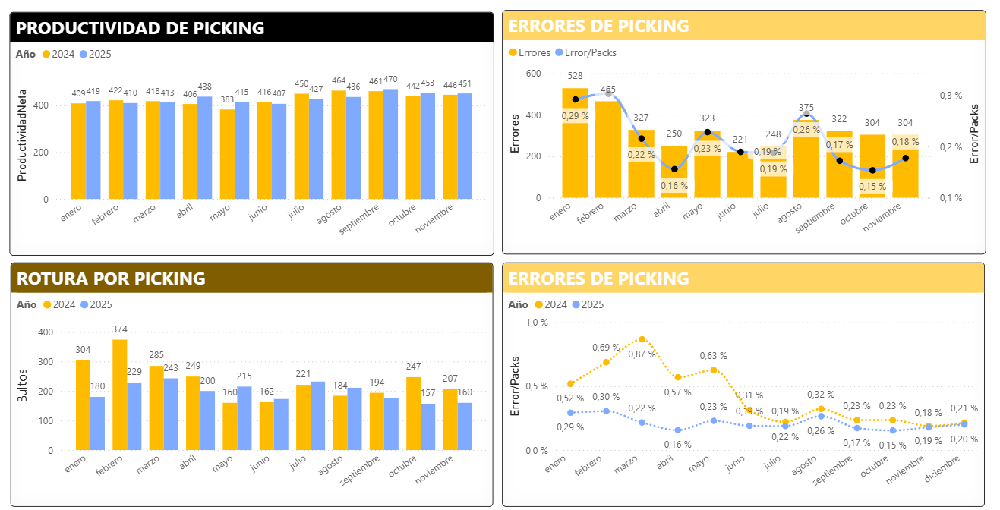
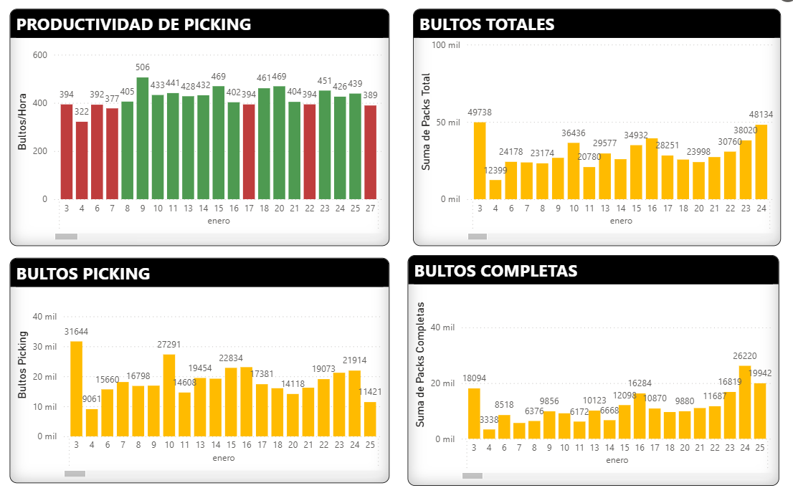

## Warehouse Picking Productivity Dashboard
### Dashboard Preview

### KPI Detail

### Context
Operational dashboard designed to monitor picking productivity in a warehouse environment, supporting workforce planning and daily performance tracking.

### Business Questions
- How does picking productivity evolve by day and month?
- Which periods show lower productivity levels?
- How does daily output relate to workforce performance?

### KPIs
- Picking productivity (units/hour)
- Total picked units
- Daily and monthly performance trends

### Tools
- Power BI
- DAX
- Excel (data source)

### Outcome
This dashboard allows supervisors and managers to identify productivity trends, detect performance drops, and take corrective actions to optimize warehouse operations.

